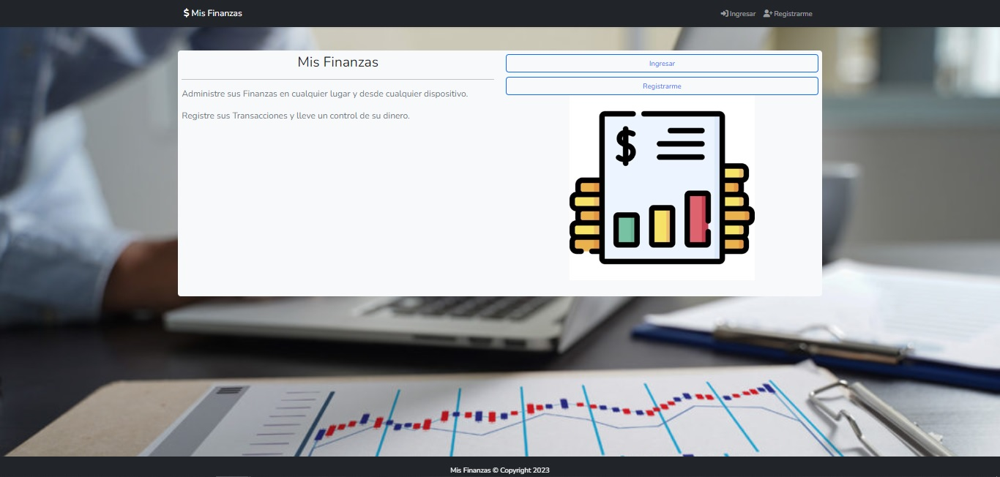
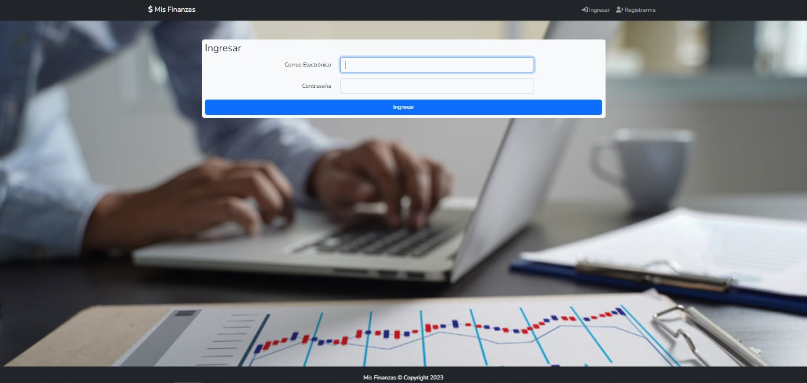
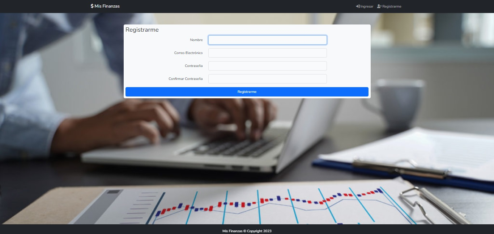
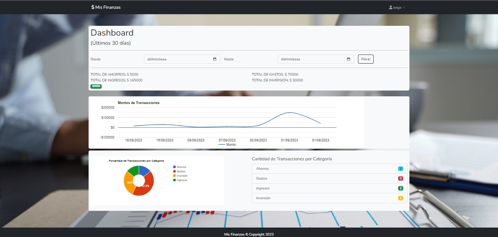
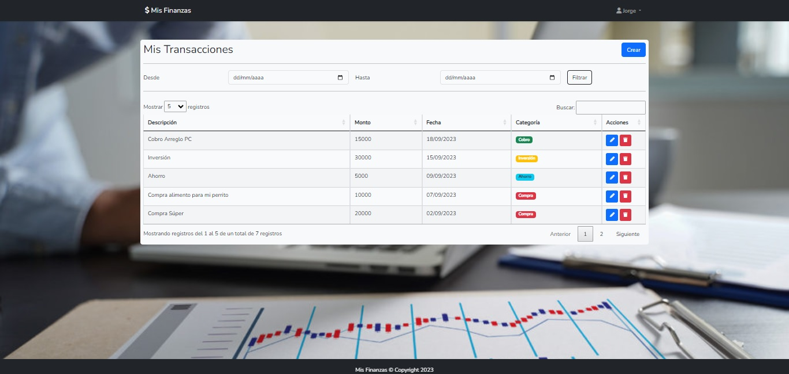
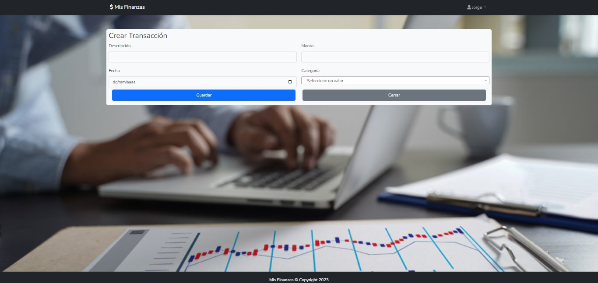
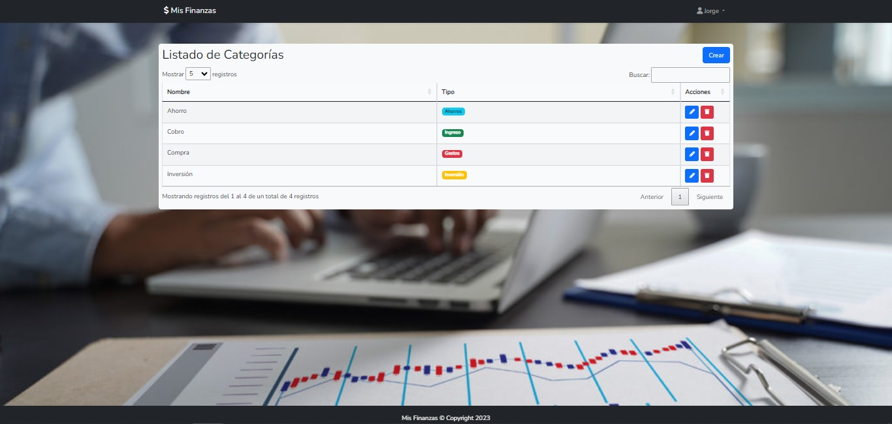
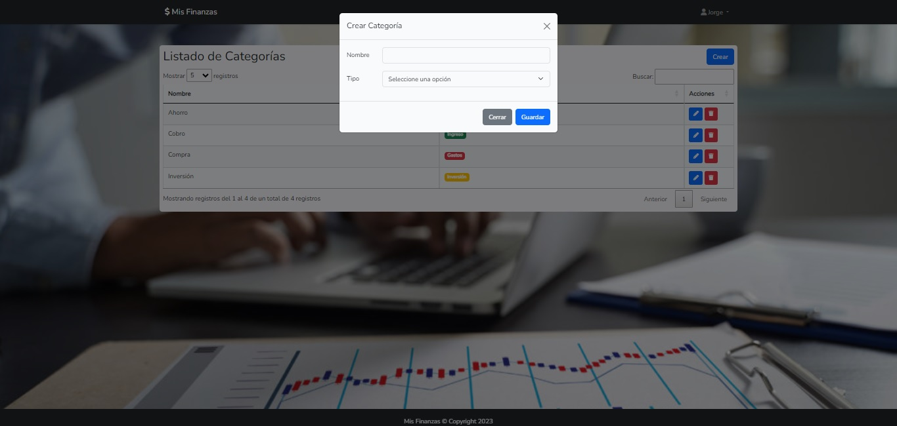

# Mis Finanzas

Administre sus Finanzas en cualquier lugar y desde cualquier dispositivo. Registre sus Transacciones y lleve un control de su dinero. 

## Instalación

1. Clonar o descargar el proyecto.
2. Abrir una terminal y ejecutar
```
composer install
```
3. Cambiar de nombre el archivo ".env.example" por ".env" y configure la conexión a la base de datos
```
DB_CONNECTION=mysql
DB_HOST=127.0.0.1
DB_PORT=3306
DB_DATABASE=nombre-base-de-datos
DB_USERNAME=usuario
DB_PASSWORD=password
```
4. Ejecutar
```
php artisan key:generate
npm install
npm run dev
```
6. Abrir otra terminal y ejecutar
```
php artisan storage:link 
php artisan migrate
```
5. Ejecutar el servidor.
```
php artisan serve
```
6. Ingresar desde: http://127.0.0.1:8000/

## Capturas de pantalla








